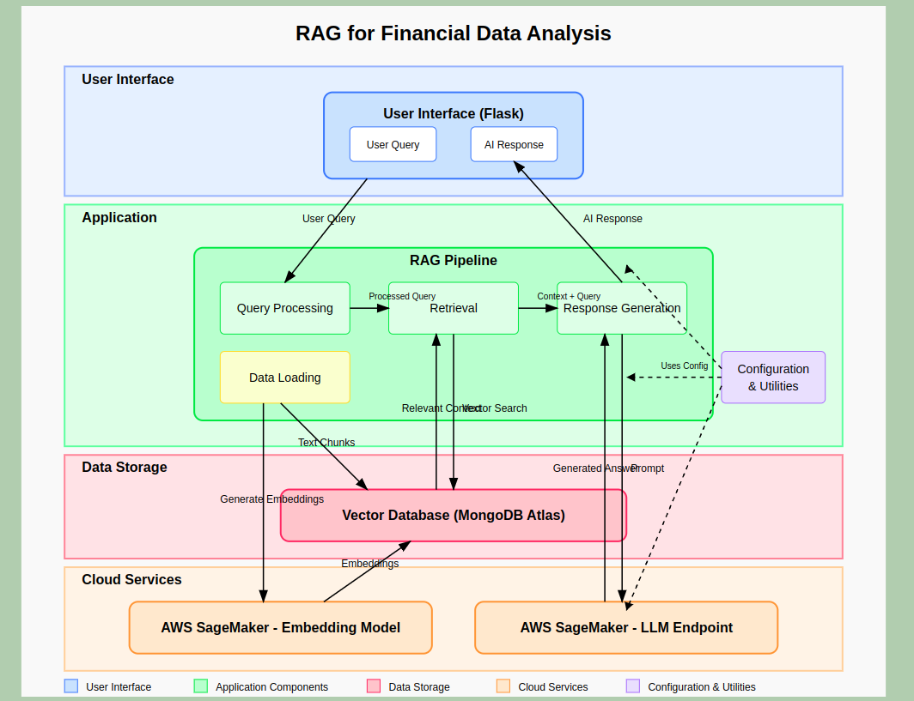
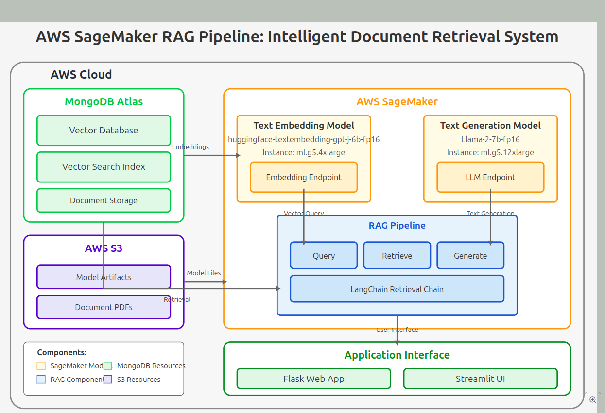

# AWS SageMaker RAG Pipeline: Intelligent Document Retrieval System


A production-ready Retrieval Augmented Generation (RAG) system built on AWS SageMaker that integrates with MongoDB Atlas for vector storage. This system demonstrates how to deploy large language models and embedding models on SageMaker, store and retrieve vector embeddings in MongoDB Atlas, and build both Flask and Streamlit interfaces for user interaction.

## 🔍 Project Overview

This project implements a complete RAG pipeline for intelligent document retrieval and question answering:

- **Text Embedding**: Uses Hugging Face's GPT-J-6B model on SageMaker to generate embeddings
- **Vector Storage**: Stores and retrieves document embeddings in MongoDB Atlas
- **Text Generation**: Uses Llama-2-7b model on SageMaker for context-aware text generation
- **Web Interfaces**: Provides both Flask and Streamlit UIs for user interaction



## 🚀 Features

- **Fully Managed AWS Infrastructure**: Leverages SageMaker for model deployment and management
- **Scalable Vector Search**: MongoDB Atlas vector search provides efficient similarity retrieval
- **Configurable RAG Pipeline**: Easily adjust parameters for retrieval and generation
- **LangChain Integration**: Uses the LangChain framework for composable RAG components
- **Dual User Interfaces**: Choose between API-focused Flask or data-focused Streamlit
- **Production-Ready Structure**: Follows software engineering best practices with modular design

## 📋 Prerequisites

- AWS Account with SageMaker access
- MongoDB Atlas account (free tier works for testing)
- Python 3.9+
- AWS CLI configured with appropriate permissions

## 🔧 Installation

1. Clone the repository:
```bash
git clone https://github.com/yourusername/RAGwithSagemaker.git
cd RAGwithSagemaker
```

2. Create and activate a virtual environment:
```bash
python -m venv venv
source venv/bin/activate  # On Windows: venv\Scripts\activate
```

3. Install dependencies:
```bash
pip install -r requirements.txt
```

4. Set up your environment variables:
```bash
cp .env.example embedding.env
# Edit embedding.env with your MongoDB Atlas connection string and AWS credentials
```

## ⚙️ Configuration

The project uses YAML configuration files to manage settings:

- `config/config.yaml`: Main configuration for AWS services
- `params.yaml`: Model parameters and RAG configuration
- `schema.yaml`: Data schemas (if needed)

Example MongoDB configuration in `params.yaml`:
```yaml
mongo:
  DB_NAME: "langchain_test_db"
  COLLECTION_NAME: "langchain_test_vectorstores"
  ATLAS_VECTOR_SEARCH_INDEX_NAME: "langchain-test-index-vectorstores"
  datafolder: "RAGwithSagemaker/data"
  embedding_dimenssion: 4096
  k: 2
  score: .2
```

## 🏃‍♂️ Running the Application

### Deploy Models to SageMaker

First, deploy the necessary models to SageMaker:

```bash
python main.py
```

This script will:
1. Set up the project structure
2. Deploy the embedding model (GPT-J-6B)
3. Deploy the text generation model (Llama-2-7b)
4. Create and configure the MongoDB vector store
5. Initialize the RAG pipeline

### Run the Flask Web App

```bash
python app.py
```

The Flask application will be available at http://localhost:5000

### Run the Streamlit Interface

```bash
cd RAGwithSagemaker
streamlit run main.py
```

The Streamlit application will be available at http://localhost:8501

## 📁 Project Structure

```
RAGwithSagemaker/
├── .github/               # GitHub workflows and actions
├── config/                # Configuration files
│   └── config.yaml        # Main AWS configuration
├── Data/                  # Data storage directory
├── research/              # Research notebooks
├── RAGwithSagemaker/      # Main module
│   ├── cloud/             # AWS and MongoDB integration
│   ├── components/        # Reusable components
│   ├── config/            # Configuration management
│   ├── constants/         # Project constants
│   ├── entity/            # Data classes and models
│   ├── logging/           # Logging setup
│   ├── utils/             # Utility functions
│   └── __init__.py        # Package initialization
├── app.py                 # Flask application
├── main.py                # Main entry script
├── params.yaml            # Model and RAG parameters
├── requirements.txt       # Project dependencies
├── schema.yaml            # Data schemas
└── setup.py               # Package setup file
```



## 🧩 Core ComponentsC

### 1. Embedding Model

The system uses Hugging Face's GPT-J-6B model for generating text embeddings. This model is deployed on an ml.g5.4xlarge instance in SageMaker.

```python
embedding_model_deploy = DeployEmbeddingModel(sagemaker_config, embeddings_config)
embedding_model_deploy.deploy_embedding_model()
```

### 2. Text Generation Model

For text generation, we use the Llama-2-7b-fp16 model deployed on an ml.g5.12xlarge instance:

```python
text_model_deploy = DeployTextGenerationModel(sagemaker_config, textgeneration_config)
text_model_deploy.creat_and_deploy_model()
```

### 3. MongoDB Vector Store

Documents are embedded and stored in MongoDB Atlas:

```python
retriever = mongo_setup(embeddings_endpoint, mongo_config)
```

### 4. RAG Pipeline

The RAG pipeline uses LangChain to connect the embedded query with relevant documents and the LLM:

```python
prompt = ChatPromptTemplate.from_template("""
Role: You are my assistant, please help me with responses based on context
<context>
{context}
</context>
Question: {input}""")

document_chain = create_stuff_documents_chain(sm_llm_endpoint, prompt)
retrieval_chain = create_retrieval_chain(retriever, document_chain)
```

## 📚 Use Cases

The system is particularly well-suited for:

- **Domain-specific QA systems**: Build knowledge bases from specialized documents
- **Drug and chemical information retrieval**: The demonstration includes a drug reaction trends analysis
- **Corporate document search**: Query internal documentation with natural language
- **Research assistance**: Find relevant information across large document collections

## 🔄 Workflow

1. Documents are loaded from PDF files
2. Text is split into chunks and embedded using the SageMaker embedding endpoint
3. Embeddings are stored in MongoDB Atlas
4. User queries are embedded using the same model
5. Similar documents are retrieved from MongoDB using vector similarity
6. The LLM generates a context-aware response using the original query and retrieved documents

## 🔐 Security

- IAM roles are used for secure AWS service access
- MongoDB connection string should be stored as an environment variable
- SageMaker endpoints are protected by AWS authentication

## 🤝 Contributing

Contributions are welcome! Please feel free to submit a Pull Request.

1. Fork the repository
2. Create your feature branch (`git checkout -b feature/amazing-feature`)
3. Commit your changes (`git commit -m 'Add some amazing feature'`)
4. Push to the branch (`git push origin feature/amazing-feature`)
5. Open a Pull Request

## 📄 License

This project is licensed under the MIT License - see the LICENSE file for details.

## 📞 Contact

MahammadRafi - mrafi@uw.edu

Project Link: [https://github.com/yourusername/RAGwithSagemaker](https://github.com/yourusername/RAGwithSagemaker)

## 🙏 Acknowledgements

- [LangChain](https://github.com/hwchase17/langchain)
- [MongoDB Atlas](https://www.mongodb.com/atlas/database)
- [AWS SageMaker](https://aws.amazon.com/sagemaker/)
- [Hugging Face](https://huggingface.co/)
- [Meta AI (for Llama-2)](https://ai.meta.com/)
